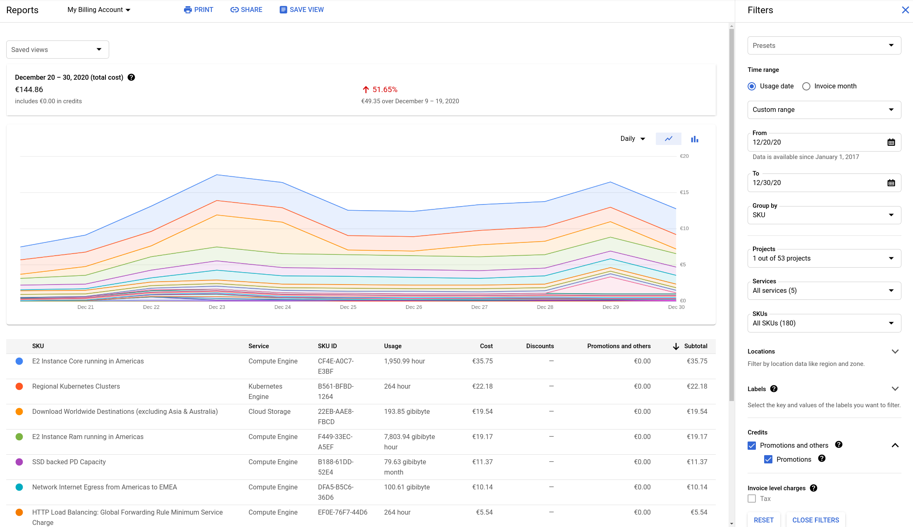

## Social contract

Between the Kusama Council and MIDLDEV OÜ, a company registered in Estonia with registry number 14973249, commonly known as [MIDL.dev](https://midl.dev).

This social contract is an off-chain coordination mechanism to advance the relation between the Kusama council and MIDLDEV OÜ in its role of external infrastructure provider.

## Services

1. A functioning infrastructure to provide usable blockchain database snapshots for the Kusama network, to the benefit of node operators and validators,
1. New snapshots at least once per day, of variety RocksDb and ParityDb, compressed in 7z format, that can be used by validators to quickly spin up or restore their infrastructure,
1. A website frontend at [polkashots.io](https://polkashots.io) with relevant metadata and download links,
1. Best effort incident and problem management,
1. Redundant implementation setup which allows for continuity, seamless upgrades and basic disaster recovery & contingency management.

### Context

We have developed the Polkashots.io website thanks to an [open grant](https://github.com/w3f/Grant-Milestone-Delivery/pull/70) from the Web 3 foundation. We now want to deploy this on the Kusama network. The development costs are nil since Polkadot and Kusama are very similar at this level, however this will incur additional recurring hosting costs which we want to cover thanks to the on-chain treasury. Plus we are really excited to submit our first on-chain proposal :)

## Operational expenses

Our current ball-park figure for expenses for the Kusama Network components of polkashots.io are 325 EUR per month, itemized as follows:

* about 7.50 EUR/day of cloud costs (or 225 EUR monthly)
* 100 EUR monthly of labour for operational upkeep described above

### Cloud cost explanation

Below is a snapshot of costs for Dec 20-30th, 2020 which show expenses of 15 EUR/day for one of our clusters which currently runs the Polkadot snapshot website (live on Polkashots.io).

This cluster shows costs of 15 EUR/day, however it is running unrelated workloads as well. We estimate the polkashots website in its current form to utilize about half of the resources, hence the 7.50 EUR/day figure.

Since Kusama and Polkadot networks are similar, we extrapolate similar costs to operate Kusama snapshot services than Polkadot snapshot services.

The costs can be roughly split as follows (based on cost breakdown screenshot):

* 40% compute
* 11% storage
* 18% kubernetes control plane
* 17% network egress (snapshot downloads)
* 14% network egress (p2p)

## Funding request from Kusama treasury

MIDLDEV OÜ will make periodic funding requests to the Kusama treasury:

* recurrent pre-paid funding of operational expenses, totaling 325 EUR/month,
* KSM base price will be determined by looking at the spot price on Coingecko at the time the invoice is submitted on-chain
* Trading-slippage will be taken into account by adding a surplus to the KSM base-price,
* An additional surplus will be taken into account for taxes owed by MIDLDEV OÜ

## Treasury proposals

The treasury proposals are written directly on Polkassembly by the account associated with the MIDL.DEV Kusama address ([EoH7Yh7S5pqwLz4fTakZcZrvyLB288ifbwhhXoXwwzrPZ5W](https://polkascan.io/kusama/account/EoH7Yh7S5pqwLz4fTakZcZrvyLB288ifbwhhXoXwwzrPZ5W).
